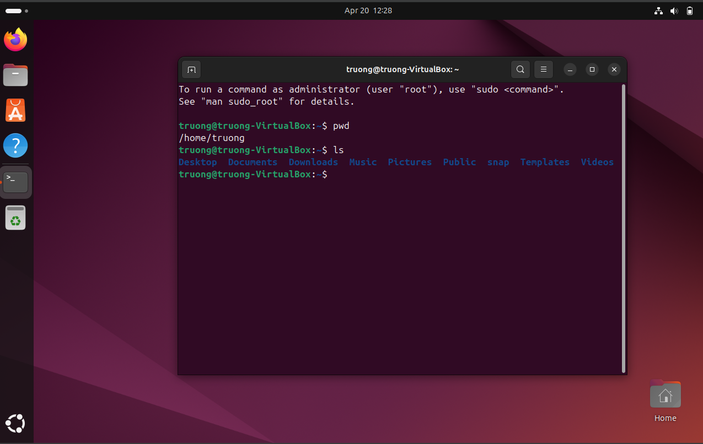
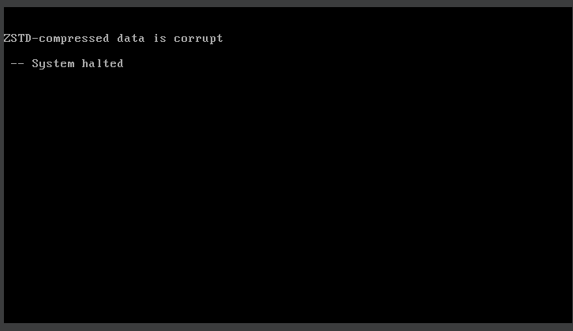
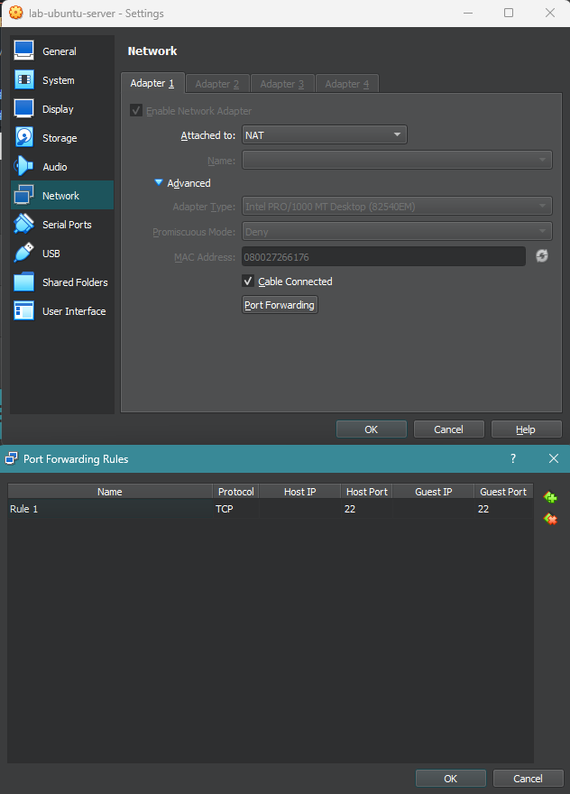
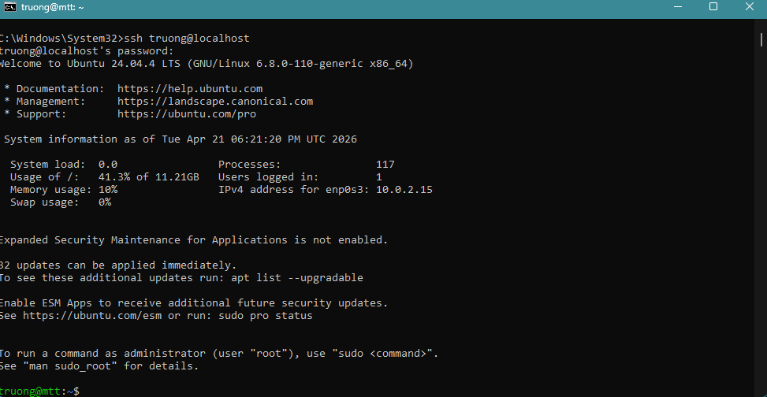

# home-lab-project

## Project Objective
To build a basic Ubuntu-based home lab environment using VirtualBox, document the installation process, and practice system setup, troubleshooting, and Linux command-line verification.

## Ubuntu Virtual Machine Setup

### 1. Download Ubuntu ISO
- Navigated to the official Ubuntu website
- Downloaded the Ubuntu Desktop LTS ISO image

### 2. Create Virtual Machine (VM)
- Opened Oracle VM VirtualBox
- Created a new virtual machine with the initial configuration below:
    - Name: lab-ubuntu-client
    - Type: Linux
    - Version: Ubuntu 24.04.4 (64-bit)
    - Memory: 2048 MB (2 GB)
    - CPU: 1 core
    - Storage: 25 GB (VDI, dynamically allocated)

### 3. Attach ISO
- Attached the Ubuntu ISO to the VM via VirtualBox storage settings

### 4. Install Ubuntu
- Started the VM and selected "Try or Install Ubuntu"
- Updated the Ubuntu installer during setup to apply latest improvements and stability fixes
- Relaunched the installer and continued the installation process
- Used default installation settings
- Enabled third-party drivers for hardware compatibility (graphics and Wi-Fi)
- Installed multimedia codecs for additional format support
- Selected "Erase disk and install Ubuntu" as the installation type
- Created a user account and password

### 5. Verification
- Successfully booted into Ubuntu
- Opened terminal and verified basic commands:
    - `pwd`
    - `ls`
  

### 6. Known Issues / Observations

#### Issue 1: Installation freeze / system halt
- Installation instability observed with 2 GB RAM allocation, resulting in freezing during setup
- "zstd-compressed data is corrupted, -- system halted" error occurred when resizing the VirtualBox window during installation  


#### Issue 2: System program notification
- A "System program problem detected" notification appeared during initial setup

---

### 7. Resolution / Fixes
- Increased VM memory allocation to 4 GB, which resolved installation stability issues
- Restarted VM and avoided resizing the VirtualBox window during installation
- Ubuntu installation completed successfully in approximately 30 minutes

## Ubuntu Virtual Machine Server Setup

### Overview
- Created a second virtual machine (`lab-ubuntu-server-01`) using Ubuntu Server LTS
- Purpose: act as a server for networking, SSH, and file transfer within the home lab

### Configuration
- Memory: 2048 MB (2 GB)
- CPU: 2 core
- Storage: 20–25 GB (VDI, dynamically allocated)

### Installation Notes
- Installation process follows a similar workflow to the Ubuntu Desktop setup documented above
- Used default installation settings with a minimal server configuration (CLI-only environment, no GUI)
- Selected "Skip unattended installation" to manually configure hostname, user account, and system settings
- Installed OpenSSH Server during setup
- Skipped installation of additional packages
- Rebooted the VM after installation
- Noted that the message `"Failed unmounting /cdrom."` can be safely ignored by pressing ENTER
- Logged into the Ubuntu Server system

---


### SSH Configuration (Port Forwarding)

#### Port Forwarding Setup (VirtualBox)
- Opened VirtualBox and accessed server VM settings
- Navigated to: Network → Adapter 1 (NAT) → Advanced → Port Forwarding
- Added a new rule:
    - Host Port: 22
    - Guest Port: 22
- Applied settings and started the VM
- Allowed Windows network access when prompted


#### SSH Connection (from Windows Host)
- Opened terminal on Windows
- Connected using:
  ```bash
  ssh truong@localhost


## WordPress Deployment (LEMP Stack Service)
- Deployed a local WordPress instance on Ubuntu Server VM
- Installed and configured Nginx, MariaDB, and PHP-FPM
- Configured database and user permissions
- Verified successful installation via browser interface
